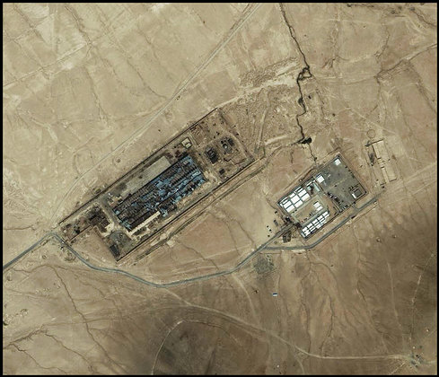

Spring 2015

Course Description

Modern democratic states often rely on practices of detention and incarceration in order to demonstrate (and increasingly, to circumvent) the power of the rule of law. As a result, international and domestic detention spaces like refugee camps, jails and for-profit prisons, war prisons, black sites, migrant detention islands, border checkpoints, and protest camps are utilized in an ever-expanding number of spatial, legal, and political contexts. In this course we will explore these spaces, and engage in a detailed historical and theoretical investigation of the complex and often-contradictory processes that produce them.

Justification

Globalization, as an economic process and spatial practice, is often associated with movement, speed, and dynamism. However, with increasing regularity, spatial isolation is called on to preserve or secure these spaces of movement and exchange. Moving beyond simple walls and cages, detention spaces are increasingly intertwined with the cross-border flows of people, goods, and capital that have come to describe global modernity. This poses challenging legal, spatial, economic, and political issues at the heart of globalization, and these will frame class discussions and debates.

